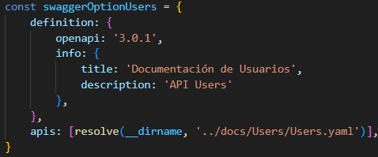
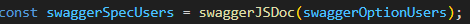
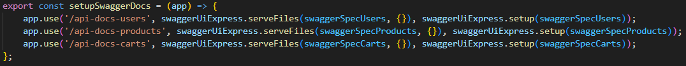

# Carrito de compra

Este proyecto implementa un sistema de gestión de carritos de compra utilizando Express, Node.js y WebSocket y Handlebars. Está configurado para escuchar el puerto 8080 y cuenta con dos grupos de rutas: **/products y /carts**. Permite al usuario crear, agregar productos y ver el contenido de los carritos de compra.
Todo el proyecto trabaja con Promises y persistencia de información implementando FileSystem.

# Instalación y creación de carpetas

Se optó por crear dos carpetas principales. La primera se llama 'manager' donde se encuentran los archivos .json con la información relacionada a los productos y los carritos. Y el productManager.js donde se encuentra la class con dicho nombre y los metodos necesarios para poder operar.
Por otro lado se encuentra la carpeta 'src' con el archivo 'app.js' y la carpeta 'routes' con los archivos, 'products.router.js' y 'carts.router.js'

Para comenzar a crear el proyecto se procedio en primera instancia por ejecutar los comandos **npm install -y** y **npm install express**. 
El primero instala las dependencias en el archivo 'package.json'y el segundo es para instalar el framework.
Además se hizo uso de una librería uuid la cual crea números unicos, la cual se instaló de la siguiente forma **npm install uuid**.
Para darle interaccion entre el navegador del usuario y el servidor se implementó WebSocket con **npm install socket.io**

Debido a esta última tecnología las importaciones comenzaron a realizarse de forma distinta, pasando de 'require' a 'import'

## App.js

1. Importación de módulos:
- express
- path
- server
- handlebars

2. Creación de la aplicacion Express:
- app = express ()
3. Manejo de rutas con routers:
- prodsRouter = require("./routes/products.router.js")
-  cartsRouter = require("./routes/carts.router.js") 
- app.use("/", prodsRouter)
- app.use("/", cartsRouter)
4. Configuración del puerto:
- const PORT = 8080
5. Configuración de Middleware:
- app.use(express.json())
- app.use(express.urlencoded)
6. Inicializar el servidor:
-app.listen(PORT)

## ProductRoutes
1. Importación de módulos:
-const express = require("express")
-const router = express.Router
-const fs = require("fs").promises
2. Creación de una instancia ProductManager:
-const ProductManager = require
-const productManager = new ProductManager

Se precisaba crear los endpoint GET, POST, PUT y DELETE
 -  **GET**, se indicó que listara todos los productos alojados en DB.json agregando que se pueda establecer un limite. Esto se llevó a cabo mediante la variable 'limit'.
Por otro lado la ruta GET /:pid muestra solo el producto según el id indicado.
-  **POST**, sólo se agrega el producto con los campos: id, title, description, code, price, status, stock, category y thumbnails. 
Se realizan las validaciones correspondientes para asegurar que los campos sean de determinado tipo con 'validateType' y que el id se autoincremente con 'lastProductId'.
Además se asegura que el status sea por defecto TRUE con la constante 'defaultStatus'.
- **PUT**, este endpoint toma un producto según su ID y los actualiza desde Body donde se valida que el ID no debe modificar o eliminar tras la actualización.
- **DELETE**, se indica el ID del producto a eliminar.

## CartsRoutes
1. Nuevamente se realizaron importaciones de Express, Routes y FileSystem.
2. Se agregaron los endpoints GET y POST.
- **POST**, la ruta raíz POST crea un nuevo carrito que cuenta unicamente con los campos id y products. El 'ID' se auto genera mediante la función 'generateId' la cual a traves de Math.random devuelve siempre un numero al azar. En el caso de 'products' se trata de un array con objetos que representan cada producto seleccionado.
- Además nos encontramos con una ruta POST que agrega un producto al array 'products' del carrito seleccionado por su 'ID' y que tiene una variable 'quantity' que contiene el numero de ejemplares de dicho producto. En este endpoint se valida que 'product' solo contenga el ID del producto y que 'quantity' se sume en caso de ser necesario.
- **GET**, esta ruta llamada por un 'ID' de carrito lista los productos correspondientes a ese carrito.

Para poder realizar la vista en tiempo real se utilizan dentro de la carpeta 'views' plantillas handlebars donde se define la vista HTML .

La plantilla de Handlebars define la estructura HTML de la pagina, se utilizan expresiones 'if', 'each', 'this', etcpara insertar datos dinamicos en la plantilla. A la vez se verifican si hay productos disponibles y los muestra en lista 'ul' o con un mensaje donde indica que no hay productos.
Cada producto se muestra en lista 'li' donde se muestra el detalle de cada cosa.

Por otro lado se incluye el formulario que precisa el usuario para ingresar los detalles de cada nuevo producto con su respectivo boton 'Subir producto'

En index.js se establece una conexión WebSocket con el servidor, envía un mensaje al servidor y escucha eventos del servidor en el cliente. Esto permite una comunicación -bidireccional- en tiempo real entre el cliente y el servidor.

## realTimeProducts.js
Acá se maneja la lógica del cliente para enviar y recibir datos del servidor a traves de WebSocket, además, actualiza la interfaz de usuario en consecuencia con los datos recibidos del servidor.

- Se comienza importando 'io' desde el módulo 'socket.io-client' para poder crear una instancia de cliente Socket.IO
- 'document.addEventListener', acá se espera a que el documento HTML esté completamente cargado antes de ejecutar el código JS. Esto asegura que el script se ejecute solo cuando el DOM esté listo para ser manipulado.
- Luego se crea una instancia de cliente Socket.IO llamando a la función 'io()' para establecer una conexíon con el servidor.
- Se agrega un evento de clic al boton 'Enviar'('btnSend') para recopilar los datos del formulario y enviar al servidor a través de WebSocket utilizando el evento 'newProduct'.
- A través de socket.on("products") se escucha el evento 'products' enviado desde el servidor. Cuando el servidor envía este evento a través de la conexión WebSocket, el callback proporcionado se ejecuta. El callback se encarga de actualizar la lista de productos en la interfaz de usuario con los datos recibidos desde el servidor.
- 'resAdd' y 'resDel' estos códigos de escucha devuelven los mensajes correspondientes de producto agregado y producto eliminado a través de un elemento 'p'.

## Swagger
Swagger es un conjunto de herramientas de código abierto que ayuda a los desarrolladores a diseñar, construir, documentar y consumir APIs (Interfaces de Programación de Aplicaciones). Es parte del ecosistema OpenAPI, que es un estándar de especificación para describir APIs RESTful.
Para utilizarlo se partió creando el archivo swagger.config dentro de la carpeta config. 

Se realizó la importación de 'fileURLToPath' y 'dirname' para manejar rutas de archivos y directorios. Por otro lado 'resolve' para obtener la ruta absoluta de los archivos a utilizar.
Tambien se importaron 'swaggerJSDoc' y 'swaggerUiExpress' los cuales sirven para generar la especificacion de OpenAPI en formato JSON a partir de las opciones que se le pasan y proporcionr middleware para servir la UI de Swagger en una aplicación con Express, como es esta.

Se comienza por configurar swagger, donde se define la version de OpenAPI y se proporciona información como el titulo y la descripcion.

Posteriormente se crea la especificacion Swagger donde se genera un objeto JSON

Finalmente se configuraron las rutas donde se muestra la documentación

Las rutas son:
- /api-docs-users: Para la documentación relacionada con la API de usuarios.
- /api-docs-products: Para la documentación relacionada con la API de productos.
- /api-docs-carts: Para la documentación relacionada con la API de carritos.

Finalmente para poder usarlo se importó en app la función con las rutas y se ejecutó para poder utilizarlas
import { setupSwaggerDocs } from "./config/swagger.config.js";
setupSwaggerDocs(app)

